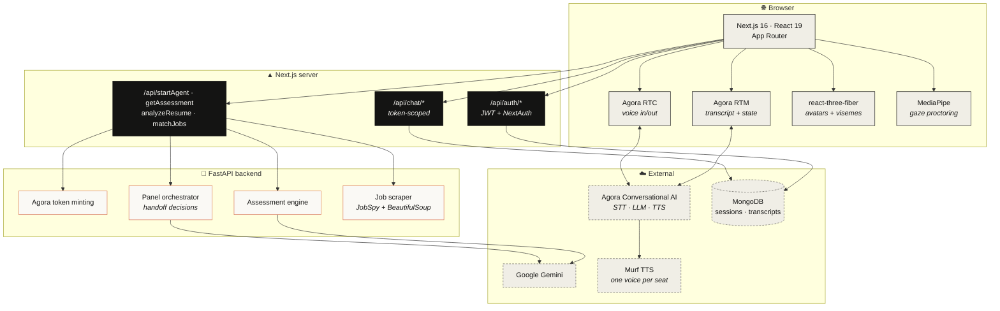
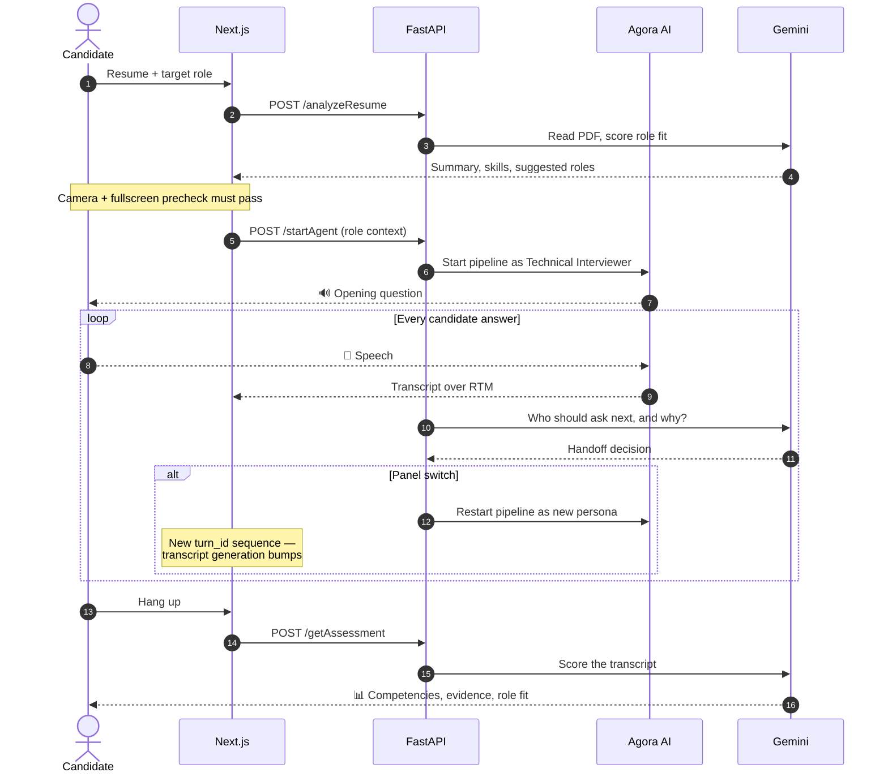

<div align="center">


### The interview room, before it counts

Live voice interviews with a three-person AI panel that listens to what you say,
follows up on it, and scores what you actually demonstrated.

[](./LICENSE)
[](https://nextjs.org/)
[](https://react.dev/)
[](https://www.python.org/)
[](https://bun.sh/)
[](https://www.agora.io/)
[](https://ai.google.dev/)

</div>

---

## What it is

Most interview practice is a list of questions and a timer. PROBE is a
conversation. You upload your resume, name the role you are chasing, and sit a
live voice interview against three AI interviewers who hand the room between
themselves mid-conversation — the way a real loop does.

The moment you hang up, the panel scores what it heard: competency by
competency, with the lines from your own transcript behind every call, and a
straight answer on whether the role actually fits.

| | |
|---|---|
| 🎙️ **Live voice, not a form** | Real-time speech via Agora's Conversational AI pipeline. The panel interrupts, probes, and follows up on the part of your answer you skated past. |
| 👥 **Three interviewers, one room** | Technical, Product, and Hiring Manager seats, each chasing a different signal, each remembering what the last one asked. |
| 🧍 **3D avatars with real lip-sync** | Word-driven visemes on rigged `.glb` models, driven off the live transcript — not volume-triggered mouth flapping. |
| 📄 **Resume-grounded questions** | Gemini reads the PDF natively; its summary and skills feed the panel's context, so questions cite your actual projects. |
| 👁️ **Proctoring** | MediaPipe gaze and face tracking, fullscreen lockdown, tab-switch and devtools detection, on a three-strike rule. |
| 📊 **Evidence-based scoring** | Competency breakdown, panel notes, contradictions, and role fit — every claim tied to transcript evidence. |
| 🎯 **Opportunities** | Live job and internship listings scraped by role and location, ranked against your resume, one click into a practice interview built from that exact posting. |

---

## Architecture



### The interview lifecycle



<details>
<summary><b>Why a panel handoff is a full pipeline restart</b></summary>

Agora's Conversational AI Engine binds one system prompt and one TTS voice per
session. Giving each interviewer their own persona *and* their own voice means
tearing the session down and starting a new one on every switch.

That has a visible consequence the frontend has to absorb: the new session
restarts its `turn_id` sequence from a low number. The vendor SDK's
`TranscriptHelper` treats `turn_id` as strictly monotonic, so feeding it a
restarted sequence makes the transcript overwrite itself mid-handoff. The fix
lives in `ConversationComponent` — each handoff commits the rendered messages,
bumps a generation counter, and mounts a fresh helper. The same counter is
folded into the id written to MongoDB so the second interviewer's "turn 1" does
not upsert over the first's.

</details>

---

## Quick start

**Prerequisites** — [Bun](https://bun.sh/), [Python 3.10+](https://www.python.org/), a
MongoDB instance, and keys for Agora, Gemini and Murf.

```bash
git clone https://github.com/jatingarg850/Knotic.git
cd Knotic

# Install dependencies and create the server virtualenv
bun run setup

# Fill in your keys
cp server/.env.example server/.env
cp web/.env.example web/.env

# Backend on :8000, frontend on :3000
bun run dev
```

Open <http://localhost:3000>.

> [!IMPORTANT]
> `JWT_SECRET` must be set and **identical** in both `.env` files. The auth
> routes refuse to start without it rather than falling back to a default —
> a fallback secret in source means anyone can forge a token for any account.

| Command | What it does |
|---|---|
| `bun run dev` | Backend and frontend together, with hot reload |
| `bun run doctor` | Checks env vars, ports and dependencies |
| `bun run verify` | Doctor + API contract checks + production build |
| `bun run build` | Production build of the web app |
| `cd web && bun run lint:fix` | Biome format and lint |

---

## Project structure

```
Knotic/
├── web/                        # Next.js 16 · React 19 · TypeScript · Tailwind
│   ├── app/
│   │   ├── api/                # Auth, chat persistence, backend proxies
│   │   └── (routes)/           # /, /login, /interview, /resume, /opportunities…
│   └── src/
│       ├── components/
│       │   ├── landing/        # Public landing page + scroll motion
│       │   ├── auth/           # Split-screen sign in
│       │   └── ui/             # Primitives + the icon barrel
│       ├── hooks/              # Proctoring, panel polling, asset loading
│       ├── lib/                # Avatars, visemes, animation, API auth
│       └── services/api.ts     # Typed facade over /api/*
├── server/                     # FastAPI · Agora tokens · Gemini · scraping
│   └── src/
│       ├── server.py           # HTTP surface
│       └── agent.py            # Panel orchestration, handoffs, assessment
└── docs/
    ├── setup/                  # Getting running locally
    ├── operations/             # Deployment, security audit, checklists
    └── reference/              # Architecture notes, integration write-ups
```

---

## Tech stack

| Layer | Choice | Why |
|---|---|---|
| **Frontend** | Next.js 16 (App Router), React 19, TypeScript | Server components for the shell, client components for the real-time surface |
| **Styling** | Tailwind CSS + CSS-variable design tokens | One palette (`paper · ink · ember`) shared by the app and the landing page |
| **Icons** | [Phosphor](https://phosphoricons.com) via `@/components/ui/icons` | A single barrel, so the whole set swaps in one file |
| **Voice** | Agora RTC + RTM, Conversational AI Engine | Managed STT → LLM → TTS with sub-second turn-taking |
| **Avatars** | react-three-fiber, drei, three.js | ARKit morph targets driven by word-timed visemes |
| **Proctoring** | MediaPipe Tasks Vision | In-browser iris and head-pose tracking, no video ever uploaded |
| **Reasoning** | Google Gemini | Handoff decisions, assessment, resume analysis |
| **Speech** | Murf TTS | A distinct voice per panel seat |
| **Data** | MongoDB | Sessions, transcripts, users |
| **Runtime** | Bun · Biome | Fast installs, one tool for lint and format |

---

## Security

Handled, and worth knowing about if you extend this:

- **Every `/api/chat/*` route derives the user from a verified bearer token**
  (`web/src/lib/apiAuth.ts`) and scopes every read and write to it. A user id
  from the query string is exactly the field an attacker controls.
- **User text never reaches a model prompt unfenced.** Job descriptions are
  scraped from third-party listing pages and transcripts are whatever the
  candidate said, so both are wrapped by `_untrusted()` in `server/src/agent.py`
  with a standing instruction that fenced content is data, never instructions.
- **Request bodies are size-bounded** by Pydantic before a handler runs.
- **Secrets are gitignored and have never been committed.** `.env.example`
  files document every required key.

Open items and the full audit are in
[`docs/operations/PRODUCTION_QUALITY_AUDIT.md`](docs/operations/PRODUCTION_QUALITY_AUDIT.md).

---

## Documentation

| | |
|---|---|
| 🚀 [Quick start](docs/setup/QUICK_START.md) · [Local setup](docs/setup/LOCAL_SETUP.md) | Get it running |
| 🎙️ [Voice setup](docs/setup/GEMINI_VOICE_SETUP.md) · [Chat persistence](docs/setup/PERSISTENT_CHAT_SETUP.md) | Wire up the pipeline |
| 📦 [Deployment](docs/operations/DEPLOYMENT_GUIDE.md) · [Verification](docs/operations/DEPLOYMENT_VERIFICATION.md) | Ship it |
| 🔐 [Security checklist](docs/operations/SECURITY_CHECKLIST.md) · [Quality audit](docs/operations/PRODUCTION_QUALITY_AUDIT.md) | Before going public |
| 🏗️ [Architecture](docs/reference/ARCHITECTURE.md) · [Project notes](docs/reference/PROJECT_UNDERSTANDING.md) | How it fits together |

---

<div align="center">
<sub>Practice interviews only — nothing PROBE produces is a real hiring decision.</sub>
</div>
# probe

# probee

